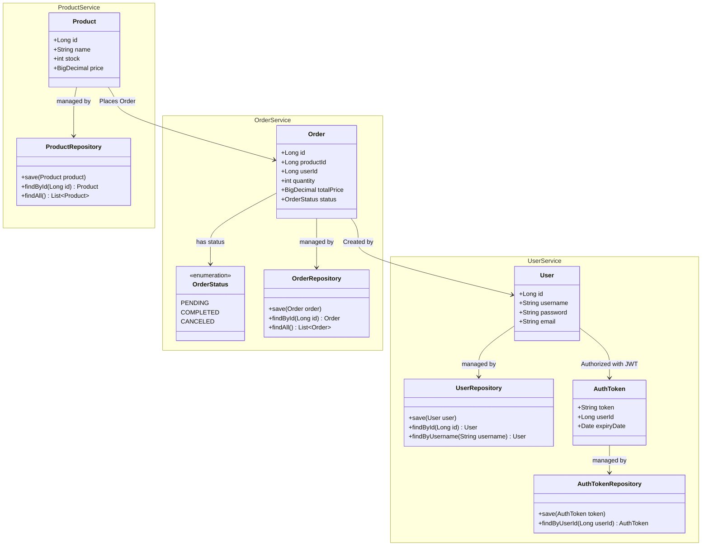
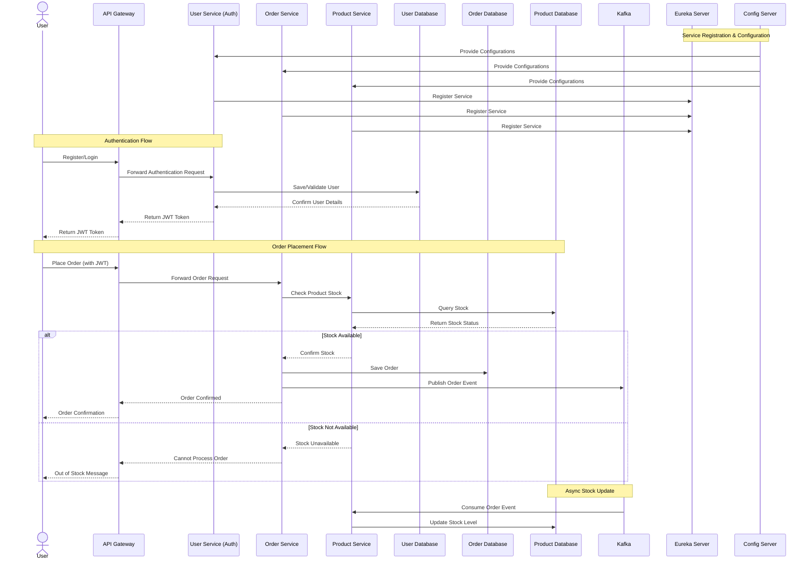

# Microservices Architecture with Spring Cloud - In Development

This project demonstrates a microservices-based architecture using Spring Cloud components for service discovery, centralized configuration, resilience, security, and messaging. The architecture includes three core microservices—Product Service, Order Service, and User Service—with supporting components such as Eureka Server, Config Server, API Gateway, and Kafka.

## Architecture Overview

### Core Services
- **Product Service**: Manages product-related data.
- **Order Service**: Manages orders and processes order-related transactions.
- **User Service**: Manages user data and authentication.

Each of these services communicates via REST APIs with added security, resilience, and gateway features.

### Supporting Components
- **Spring Cloud Config Server**: Centralized configuration management using a Git repository for config storage.
- **Eureka Server (Service Discovery)**: Manages service registration and discovery.
- **Spring Cloud API Gateway**: Acts as the entry point, handling routing, load balancing, and security.
- **Circuit Breaker (Resilience4j)**: Protects against cascading failures and adds resilience.
- **Security (OAuth2 + JWT)**: Implements authentication and authorization using OAuth2 and JWT.
- **Kafka**: Facilitates asynchronous communication between services.

## Project Components

1. **Config Server**
   - Centralized configuration for all services.
   - Stores configuration files in a Git repository.
   - Each microservice retrieves its configuration from the Config Server.

2. **Eureka Server (Service Discovery)**
   - Registers each microservice, making them discoverable.
   - Enables load balancing and scaling by allowing services to find each other dynamically.

3. **API Gateway**
   - Provides a unified entry point for all requests to the microservices.
   - Routes requests to the appropriate service based on routing rules.
   - Secures routes using JWT-based authentication.

4. **Circuit Breaker (Resilience4j)**
   - Adds resilience by preventing cascading failures.
   - Configures fallback methods for each service, ensuring graceful degradation in case of service failure.

5. **Security (OAuth2 + JWT)**
   - User Service issues JWT tokens after authentication.
   - Gateway verifies JWT tokens for secure access to protected routes.

6. **Kafka**
   - Provides asynchronous communication between services.
   - Order Service sends events when an order is placed, and Product Service listens to update product stock.

## UML Diagram

## Sequence Diagram

## Setup Instructions

1. Clone the repository.
2. Configure the Config Server with your Git repository for centralized configuration.
3. Set up and run the Eureka Server, API Gateway, and each microservice (Product, Order, and User).
4. Configure Kafka for event-driven communication.
5. Deploy and test using the API Gateway entry point.

## License

This project is licensed under the MIT License. See the [LICENSE](LICENSE) file for details.
